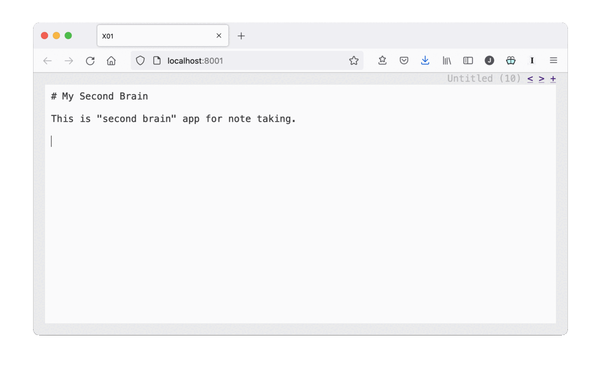

# Nolific (X1)

A very simple web based note solution that's designed to serve as my second brain.



## Getting Started

To start the tool simply clone the repo and then run PHP in server mode (for development and testing only) from the repo's root directory.

```
git clone git@github.com:codazoda/nolific.git
cd nolific
php -S 0:8001
```

Then open your web browser and point it to `https://localhost:8001`.

## More Information

The back-end of this is currently a very poorly written PHP application. I wrote part of the application before I figured out how I wanted to organize it. Still, it's a really simple application and I plan to clean it up later. In the long term I'm thinking I may re-write it in GO once I get a feel for how it works for me. PHP is the language I use professionally and have for many years, so it currently serves as my hammer.

The front-end uses htmx (but there's also a little bit of old JS code in there too). Just like the back-end, I added a bit of code before I settled on htmx. This is also my first time using htmx.

## X as in Experiments

This tool was originally called X1 and I've now renamed it to Nolific.

Naming software experiments is a barrier to entry for me. Typically, I need to come up with a name before I can even create a project. Using numbers removes that burden and lets me start with a readme or a bit of code. This is the first of those numbered experiments.

Because their numbered, I can more easily decide on ports and domain names to run them on. For example, for development work, I'll run experiments on port 8000-8999. Since this is experiment number one, I'll run it on port 8001.

## Running Automatically on Mac

I've created a `com.joeldare.x1.plist` file that starts the system automatically on localhost. I symlink this file from `~/Library/LaunchAgents` and the Mac OS launchd system will launch it automatically and keep it running.

## Font Awesome

I've included Font Awesome x.x to use as the navigation.
